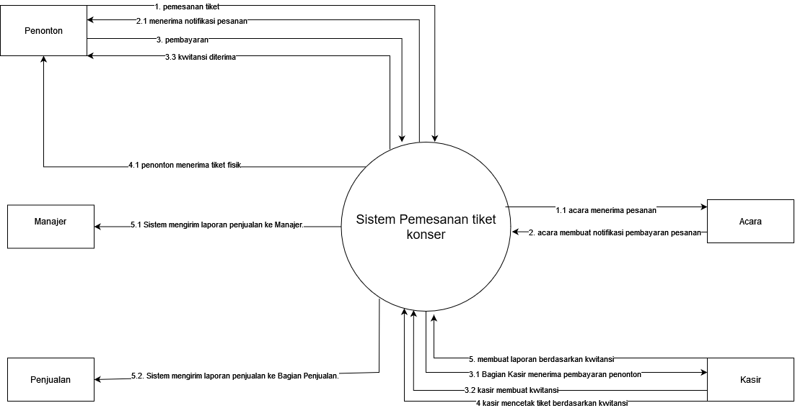
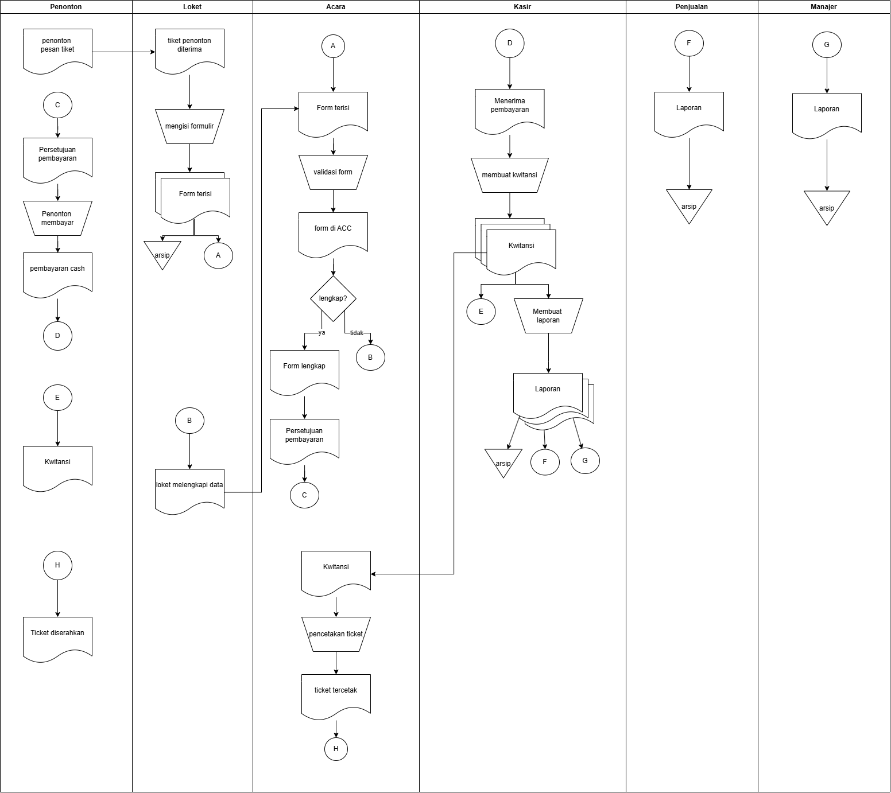
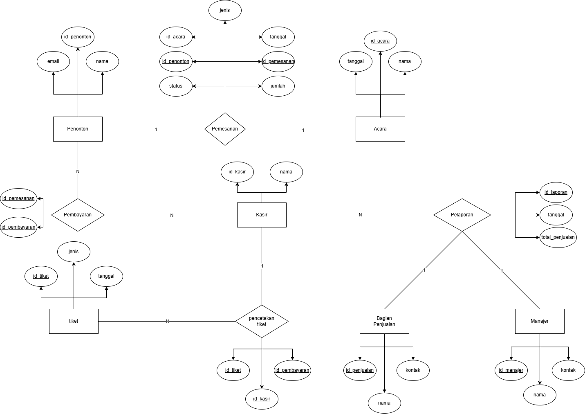

# Sistem Pemesanan Tiket Konser — System Analysis & Design
## Project: Business Process Modeling & Information System Design

Proyek kelompok ini menganalisis dan merancang sistem informasi untuk otomatisasi proses pemesanan tiket konser. Meliputi pembuatan Flowmap (as-is process), Context Diagram, Data Flow Diagram (DFD) Level 0, dan Entity Relationship Diagram (ERD) untuk transformasi proses manual menjadi sistem digital terotomatisasi.

---

## Ringkasan Singkat

**Sistem dirancang untuk:**
- **Otomatisasi end-to-end** proses pemesanan tiket (dari booking hingga reporting)
- **Eliminasi arsip manual** dengan database terpusat
- **Real-time payment processing** (cash, digital payment)
- **Automated reporting** untuk Kasir, Bagian Penjualan, dan Manajer
- **Notifikasi otomatis** pengingat tiket untuk customer

---

## Business Problem

### Kondisi Manual (As-Is):
- Penonton memesan tiket di loket dengan formulir fisik (2 rangkap)
- Approval manual oleh Bagian Acara untuk validasi data
- Arsip fisik tersebar (Loket, Kasir, Penjualan, Manajer)
- Laporan penjualan dibuat manual (3 rangkap terpisah)
- Risiko: data loss, slow processing, human error, no audit trail

### Solusi Digital (To-Be):
- **Sistem online booking** dengan validasi data real-time
- **Database terpusat** untuk semua entitas (Penonton, Tiket, Pembayaran, Laporan)
- **Automated approval workflow** dengan notifikasi
- **Multi-payment gateway** (cash & digital)
- **Dashboard reporting** untuk analitik penjualan

---

## Deliverables

### 1. Flowmap (As-Is Process)

**Aktor yang terlibat:**
- **Penonton**: Memesan tiket, memilih jenis & jumlah, melakukan pembayaran
- **Loket**: Mengisi formulir pemesanan, validasi data
- **Acara**: Approve atau reject booking berdasarkan kelengkapan data
- **Kasir**: Menerima pembayaran, menerbitkan kwitansi, membuat laporan penjualan
- **Penjualan**: Menerima laporan penjualan untuk inventory tracking
- **Manajer**: Menerima laporan agregat untuk decision making

**Dokumen yang dihasilkan:**
- Formulir Pemesanan (2 rangkap)
- Form ACC/Reject dari Bagian Acara
- Kwitansi Pembayaran
- Laporan Penjualan (3 rangkap)
- Tiket Konser (cetak fisik)

### 2. Context Diagram (System Boundary)

Diagram level tertinggi yang menunjukkan interaksi sistem dengan external entities:
- **Input**: Data penonton, permintaan pembayaran, permintaan laporan
- **Output**: Tiket cetak, kwitansi, laporan (Kasir/Penjualan/Manajer), notifikasi

**External Entities:**
- Penonton (Customer)
- Bagian Acara (Approval Authority)
- Kasir (Payment Processor)
- Penjualan (Inventory)
- Manajer (Reporting)

### 3. Data Flow Diagram (DFD) Level 0

**Proses Utama:**
1. **Pelaporan** — Sistem generate laporan penjualan untuk Manajer & Penjualan
2. **Notifikasi** — Sistem kirim notifikasi pesanan ke Penonton
3. **Pembayaran** — Kasir menerima pembayaran, sistem terbitkan kwitansi
4. **Pencetakan Tiket** — Sistem cetak tiket berdasarkan kwitansi valid
5. **Pemesanan** — Penonton order tiket, sistem validasi & kirim ke Acara untuk ACC

**Data Stores:**
- **D1: Pelaporan** — Store laporan penjualan untuk analitik
- **D2: Pembayaran** — Store transaksi pembayaran (cash, digital)
- **D3: Pencetakan Tiket** — Store tiket yang sudah tercetak
- **D4: Pesanan** — Store booking order dari Penonton

### 4. Entity Relationship Diagram (ERD)

**Entitas Utama & Atribut:**

#### **1. Penonton**
- **Primary Key**: id_penonton
- **Atribut**: nama, email
- **Relasi**: 
  - 1 Penonton dapat melakukan **N Pembayaran** (1:N)
  - 1 Penonton dapat melakukan **N Pemesanan** (1:N)

#### **2. Acara**
- **Primary Key**: id_acara
- **Atribut**: tanggal, nama
- **Relasi**:
  - 1 Acara memiliki **N Pemesanan** (1:N)

#### **3. Pemesanan**
- **Primary Key**: Composite (id_acara, id_penonton)
- **Foreign Keys**: id_acara, id_penonton
- **Atribut**: tanggal, id_pemesanan, jumlah, jenis, status
- **Relasi**:
  - N:1 dengan **Penonton**
  - N:1 dengan **Acara**
  - 1:N dengan **Pembayaran**

#### **4. Tiket**
- **Primary Key**: id_tiket
- **Atribut**: jenis, tanggal
- **Relasi**:
  - 1 Tiket dicetak melalui **N Pencetakan Tiket** (1:N via relationship)
  - Many-to-Many dengan **Kasir** via **Pencetakan Tiket**

#### **5. Kasir**
- **Primary Key**: id_kasir
- **Atribut**: nama
- **Relasi**:
  - 1 Kasir memproses **N Pembayaran** (1:N)
  - 1 Kasir mencetak **N Tiket** via **Pencetakan Tiket** (1:N)
  - 1 Kasir membuat **N Pelaporan** (1:N)

#### **6. Pembayaran**
- **Primary Key**: Composite (id_pembayaran, id_pemesanan)
- **Foreign Keys**: id_pemesanan
- **Atribut**: jenis
- **Relasi**:
  - N:1 dengan **Penonton**
  - N:1 dengan **Kasir**

#### **7. Pencetakan Tiket**
- **Relationship Entity** (Many-to-Many resolver)
- **Primary Key**: Composite (id_tiket, id_pembayaran)
- **Foreign Keys**: id_tiket, id_pembayaran, id_kasir
- **Relasi**:
  - N:1 dengan **Tiket**
  - N:1 dengan **Pembayaran**
  - N:1 dengan **Kasir**

#### **8. Pelaporan**
- **Primary Key**: Composite (id_laporan, id_kasir)
- **Foreign Keys**: id_kasir
- **Atribut**: tanggal, total_penjualan (agregat dari Pembayaran)
- **Relasi**:
  - N:1 dengan **Kasir**
  - 1:1 dengan **Bagian Penjualan** (report copy)
  - 1:1 dengan **Manajer** (report copy)

#### **9. Bagian Penjualan**
- **Primary Key**: id_penjualan
- **Atribut**: nama, kontak
- **Relasi**:
  - 1:1 dengan **Pelaporan** (receives report)

#### **10. Manajer**
- **Primary Key**: id_manajer
- **Atribut**: nama, kontak
- **Relasi**:
  - 1:1 dengan **Pelaporan** (receives report)

**Kardinalitas:**
- **1:N** — One-to-Many (e.g., 1 Kasir → N Pembayaran)
- **N:M** — Many-to-Many (e.g., Tiket ↔ Pembayaran via Pencetakan Tiket)
- **1:1** — One-to-One (e.g., Pelaporan → Manajer)

---

## Normalisasi Database (3NF)

### Bentuk Normal Pertama (1NF)
- Semua atribut atomic (tidak ada multi-valued attributes)  
- Setiap tabel memiliki primary key

### Bentuk Normal Kedua (2NF)
- Sudah memenuhi 1NF  
- No partial dependency (semua non-key attributes bergantung penuh pada primary key)  
- Contoh: Pemesanan menggunakan composite key (id_acara, id_penonton), semua atribut lain (tanggal, jumlah, status) bergantung penuh pada kedua key ini

### Bentuk Normal Ketiga (3NF)
- Sudah memenuhi 2NF  
- No transitive dependency (non-key attributes tidak bergantung pada non-key attributes lain)  
- Contoh: Pelaporan hanya menyimpan id_kasir (FK), tidak menyimpan nama_kasir (mengambil dari tabel Kasir via JOIN)

---

## Key Features (System Requirements)

### Fungsional
1. **Online Ticket Selection**
   - Pilih waktu konser
   - Pilih tipe tiket (VIP, Reguler, dll)
   - Pilih jumlah tiket
   - Real-time availability check

2. **Automated Approval Workflow**
   - Form validation (data lengkap?)
   - Auto-send ke Bagian Acara untuk ACC
   - Email/notifikasi approval status

3. **Multi-Payment Gateway**
   - Cash (on-site)
   - Digital payment (e-wallet, kartu kredit)
   - Payment confirmation otomatis

4. **Ticket Generation & Delivery**
   - Generate QR code untuk e-ticket
   - Email delivery otomatis
   - Cetak fisik option di loket

5. **Automated Reporting**
   - Dashboard real-time untuk Kasir (daily sales)
   - Report untuk Penjualan (inventory sold)
   - Executive summary untuk Manajer (trend, revenue)

6. **Notification System**
   - Konfirmasi booking via email/SMS
   - Reminder H-1 konser
   - Payment confirmation

### Non-Fungsional
- **Performance**: Handle 1000+ concurrent bookings
- **Security**: Encrypted payment data, role-based access
- **Usability**: Mobile-friendly interface
- **Reliability**: 99.9% uptime, backup data daily

---

## Technology Stack (Proposed)

Jika sistem ini diimplementasikan, stack yang disarankan:

| Component | Technology |
|-----------|------------|
| **Frontend** | React.js / Vue.js (responsive web app) |
| **Backend** | Node.js (Express) / Python (Flask/Django) |
| **Database** | PostgreSQL / MySQL |
| **Payment Gateway** | Midtrans / Stripe / Xendit |
| **Notification** | Twilio (SMS), SendGrid (Email) |
| **Reporting** | Chart.js / D3.js for dashboard visualization |
| **QR Code** | QR Code Generator library |
| **Deployment** | Docker, AWS/GCP, CI/CD pipeline |

---

## Business Impact

Jika sistem ini diimplementasikan:

### Efficiency Gains
- **70% reduction** in booking processing time (manual form → digital)
- **90% reduction** in reporting overhead (auto-generate vs manual 3-copy reports)
- **Eliminate paper waste** (formulir, arsip fisik)

### Revenue Opportunities
- **24/7 booking availability** → increase sales window
- **Data analytics** → optimize pricing, identify peak demand
- **Customer retention** → email marketing & loyalty program via database

### Risk Mitigation
- **No data loss** → centralized database dengan backup
- **Audit trail** → track semua transaksi untuk compliance
- **Fraud prevention** → QR code validation, payment gateway security

---

## Lisensi

- **Project**: Academic assignment untuk educational purposes
- **Diagrams**: Open untuk referensi & learning
- **Figma Prototype Link:** https://www.figma.com/design/g07HpTiRGC9yP1MyeeSamZ/ANSI?node-id=163-271&t=0aDKtOrFROnJeyAy-1
